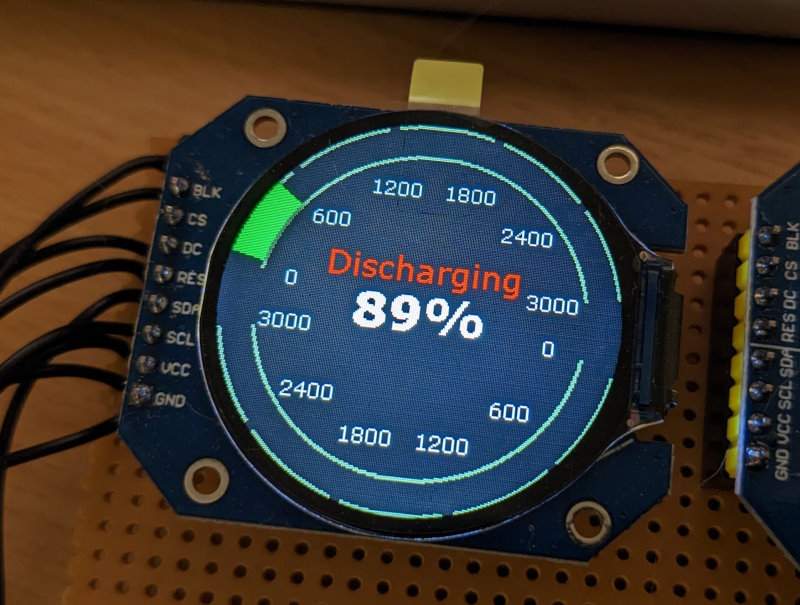

# esphome-gauge

This is a work-in-progress that I am publishing in case it's of use to anybody else. I'm short on time and haven't had the time/skills to refine this to where it should be.

The idea is to plot a circular gauge on a gc9a01 (smart watch) display using the native display component within ESPHome. The advantage is that you could mix-and-match data synced from Home Assistant, data directly from the ESPHome device itself, and use the display component's nice text rendering methods.

I used the built-in `graph` component as a basis to work from, and added some functions to the `display` component to deal with the plotting. I'm not sure the correct way which this should be extended, so for the moment I use a copy of the component and it will override the built in one. Obviously this means that the code will need to be updated as and when the base component is, and any major changes could break your ESPHome installation until it's updated.

`example.yaml` is an ESPHome configuration which is a starting point for using it. It displays two 180 degree graphs with a coloured gauge that fills according to a value from Home Assistant, in my case it was whether my home storage battery is charging or discharging.

